# 🔆 Admin Panelli Ajans Web Sitesi

## 📌 Proje Tanıtımı
Bu proje, ajans kurumları için yönetilebilir ve sürdürülebilir bir web sitesi sağlamaktadır. Admin paneli sayesinde, kullanıcı verileri üzerinde tam kontrol sağlanarak CRUD (Create, Read, Update, Delete) işlemleri gerçekleştirilebilir. Veriler, Microsoft SQL Server (MSSQL) tabanlı bir veritabanı ile yönetilmektedir.

## 🚀 Kullanılan Teknolojiler

- 📄 **HTML – Sayfa içeriği ve yapısı için**
- 🎨 **CSS – Stil ve tasarım için**
- 🌐 **Bootstrap – Responsive ve modern tasarım için**
- 🎯 **Microsoft SQL Server (MSSQL) – Veritabanı yönetimi için**
- 🔄 **CRUD İşlemleri – Veritabanı işlemleri için**
- 🧩 **Entity Framework – ORM (Object-Relational Mapping) için**
- 🔐 **Authorize İşlemleri – Kullanıcı yetkilendirme ve güvenlik için**
- 💻 **ASP.NET MVC – Web uygulaması geliştirme için**
- 🧭 **Code First Yaklaşımı – Veritabanı modellemesi için**
- 🔍 **LINQ Sorguları – Veritabanı işlemlerini kolaylaştırmak için**
- 🗂️ **Layout Kontrolü – Sayfa düzenlerinin yönetimi için**

## 🔹 Proje Özellikleri

- ✅ **Kullanıcı yönetimi ve yetkilendirme**
- ✅ **Admin paneli üzerinden dinamik içerik yönetimi**
- ✅ **Modern ve responsive arayüz**
- ✅ **Verimli veri yönetimi ve güçlü sorgulama yetenekleri**
- ✅ **Kullanıcı dostu bir deneyim**

Bu proje, ajans kurumları için iş süreçlerini kolaylaştırmayı hedeflemekte olup, modüler ve genişletilebilir bir yapıya sahiptir. 🎯

# **PROJEDEN KARELER**

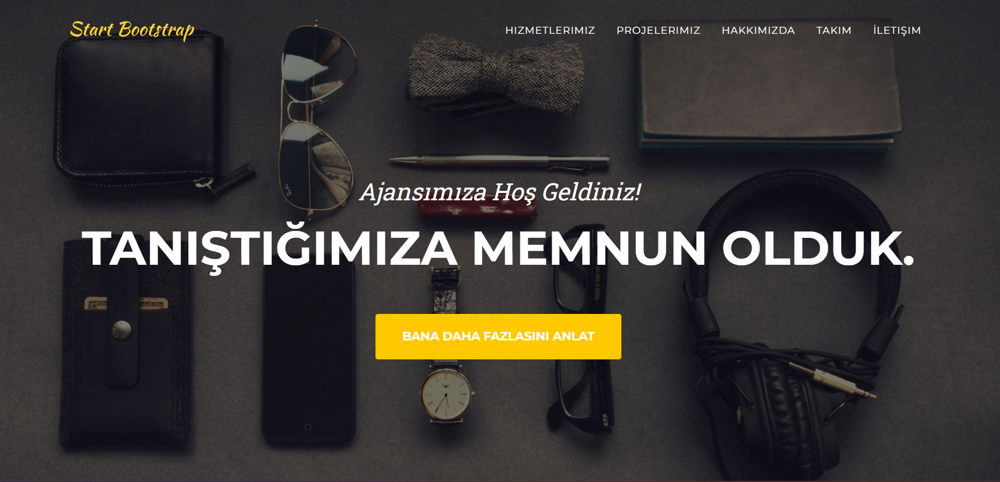
---
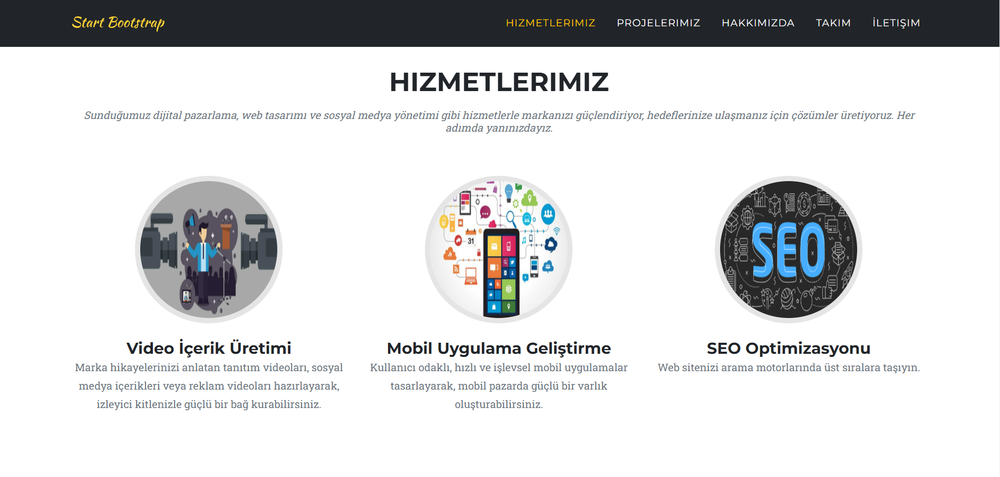
---

---
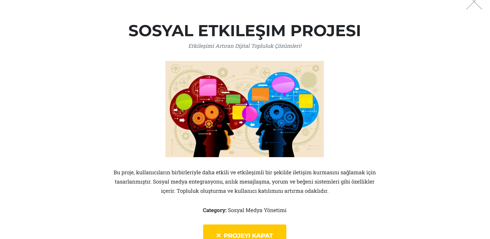
---
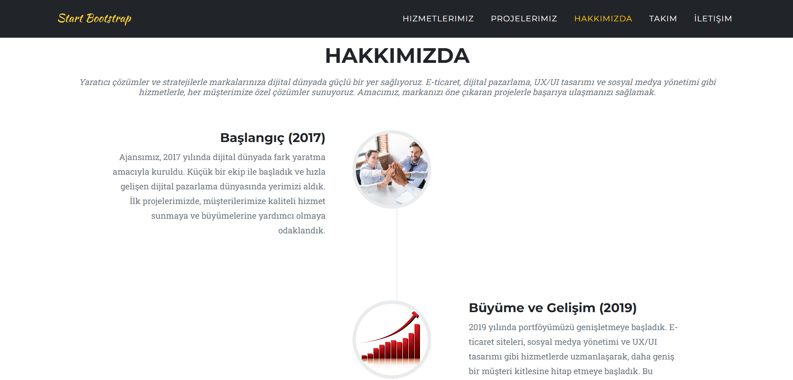
---
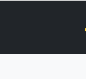
---
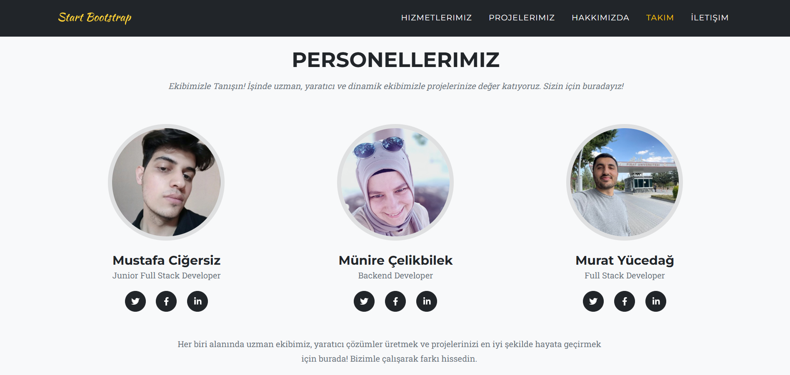
---
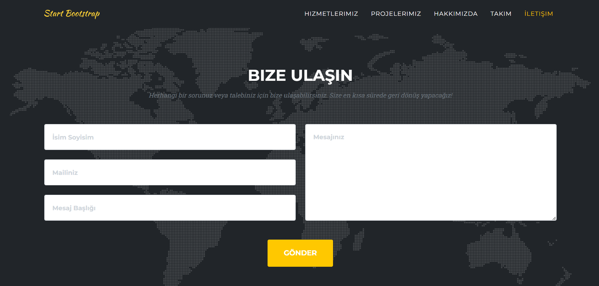
---
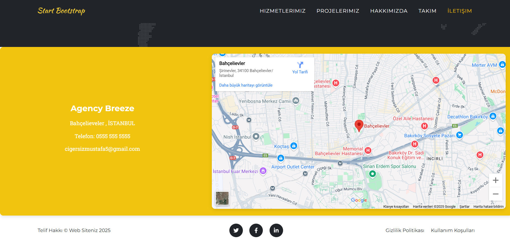
---
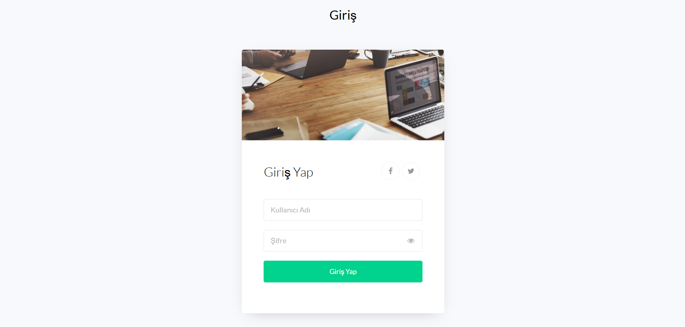
---
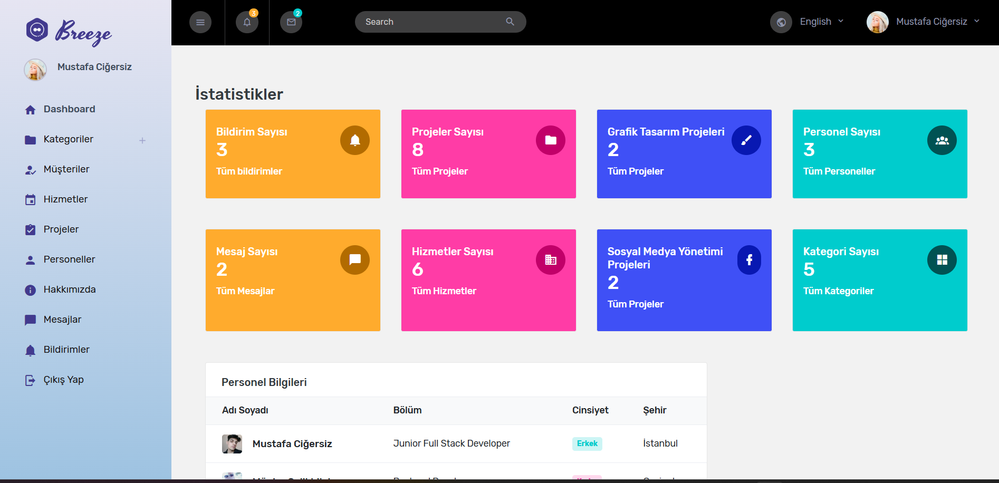
---
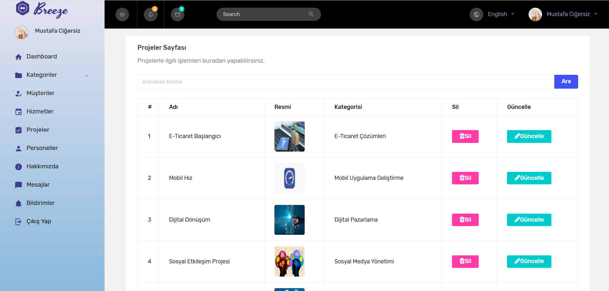
---
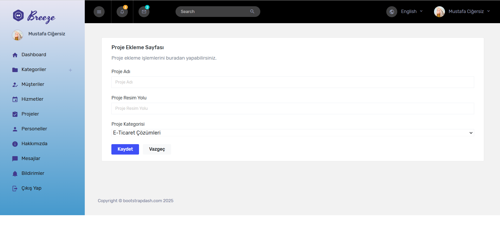
---

